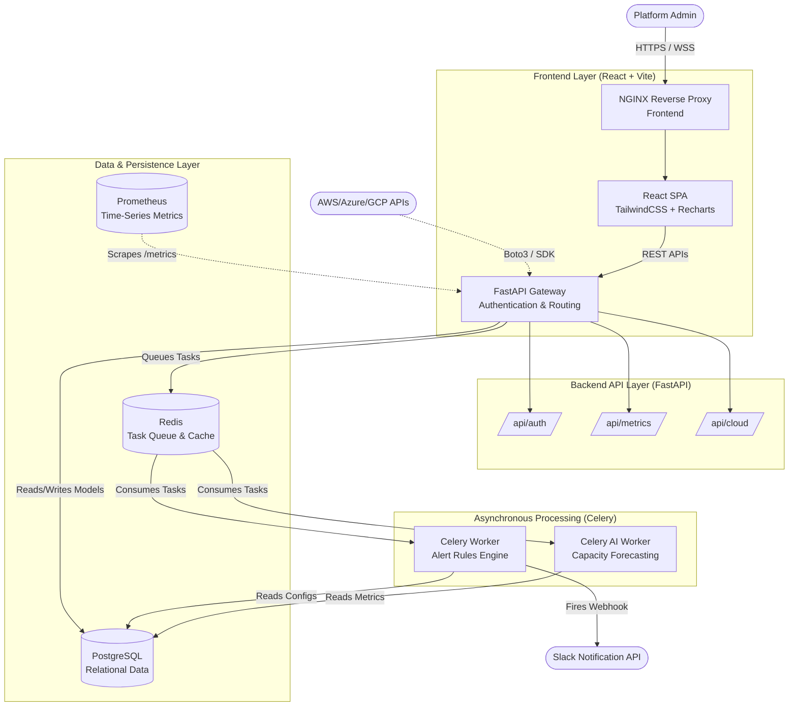

# Cloud Infrastructure Monitoring Dashboard ☁️📊

**Real-Time Cloud Infrastructure Health, Uptime Monitoring, and Observability Platform.**

An enterprise-grade, cloud-native monitoring solution designed to provide deep observability into AWS resources, multi-cloud environments (Azure/GCP), containerized applications (Docker/Kubernetes), and bare-metal Linux/Windows servers. 

---

## 🏗️ Architecture & Structure Diagram

The platform is designed as a distributed, microservices-oriented architecture.



---

## 📂 Deep Folder Structure

The repository follows a clean-architecture monorepo pattern.

```text
cloud-monitoring-dashboard/
├── backend/                  # Python FastAPI application
│   ├── alembic/              # Database migration scripts
│   ├── api/                  # API routing layer
│   │   ├── routers/          # Modular API endpoints (auth, metrics, cloud)
│   │   └── deps.py           # Dependency injection (e.g. get_db, get_current_user)
│   ├── cloud/                # Cloud Provider integrations
│   │   ├── aws.py            # Boto3 auto-discovery and Cost Explorer
│   │   ├── azure_agent.py    # Azure VM discovery stubs
│   │   ├── gcp_agent.py      # GCP Compute discovery stubs
│   │   ├── docker_agent.py   # Docker daemon integration
│   │   └── k8s_agent.py      # Kubernetes API integration
│   ├── core/                 # Core utilities
│   │   ├── config.py         # Pydantic environment configurations
│   │   ├── logger.py         # Structured system logger
│   │   └── security.py       # JWT and Password hashing logic
│   ├── notifications/        # Alerting dispatchers (slack.py)
│   ├── database.py           # SQLAlchemy engine setup
│   ├── main.py               # FastAPI ASGI entrypoint
│   ├── models.py             # SQLAlchemy ORM definitions
│   ├── schemas.py            # Pydantic payload validations
│   ├── worker.py             # Celery standard alerts engine
│   └── worker_ai.py          # Celery AI/ML capacity forecasting engine
│
├── frontend/                 # React UI application
│   ├── src/
│   │   ├── components/ui/    # Reusable Tailwind UI (HeatMap.tsx)
│   │   ├── layouts/          # Page wrappers (DashboardLayout.tsx)
│   │   ├── pages/            # Core views (Login.tsx, Dashboard.tsx)
│   │   ├── App.tsx           # React Router DOM configuration
│   │   └── index.css         # Global Tailwind and Glassmorphism utilities
│   ├── tailwind.config.js    # Tailwind themes and custom colors
│   └── package.json          # Node dependencies
│
├── deployment/               # Cloud-native deployment tooling
│   ├── docker-compose.yml    # Local multi-container orchestration
│   ├── prometheus.yml        # Time-series scrape configurations
│   └── helm/                 # Kubernetes Helm Chart (values.yaml, Chart.yaml)
│
├── tests/                    # Comprehensive QA Suite
│   ├── backend/              # Pytest for FastAPI and Celery
│   ├── frontend/             # Vitest for React component assertions
│   └── e2e/                  # Playwright for browser UI workflows
│
└── .github/workflows/        # CI/CD GitHub Actions (ci.yml)
```

---

## 🚀 Features Breakdown

### Core Modules
1. **RBAC Authentication**: Secure JWT-based login, registration, and session management.
2. **Dynamic Ingestion API**: Securely ingest point-in-time metrics (CPU, Memory, Disk) from target servers.
3. **Rules Engine**: Asynchronous Celery workers evaluating metric thresholds against PostgreSQL rule configurations in real-time.
4. **Interactive Dashboard**: Modern React frontend utilizing Recharts and Glassmorphism aesthetics for visualizing metric histories.
5. **Prometheus Integration**: Configured endpoints and dockerized environments for time-series scraping.

### Advanced Bonus Features
1. **AWS Cost Dashboard**: Daily API fetches using AWS Cost Explorer to track cloud expenditure.
2. **Multi-Cloud Discovery**: Native hooks into AWS Boto3 (with Azure and GCP stubs) to map out compute instances globally.
3. **AI Capacity Forecasting**: Dedicated background processes that project when a server will hit 100% disk or CPU exhaustion using historical data mapping.
4. **Global Heat Map**: A geographic grid view highlighting the health (healthy, warning, critical) of specific regions at a glance.

---

## 🛠️ Quick Start & Setup

### Prerequisites
- Docker & Docker Compose
- Node.js 20+ (for local frontend dev)
- Python 3.12+ (for local backend dev)

### 1. Run Everything via Docker (Production Simulation)
We have fully containerized the platform. Start the PostgreSQL DB, Redis cache, and Prometheus monitor using Docker Compose:
```bash
cd deployment
docker-compose up -d
```

### 2. Local Backend Development
```bash
cd backend
python -m venv venv
source venv/bin/activate  # (or .\venv\Scripts\activate on Windows)
pip install -r requirements.txt

# Run Migrations
alembic upgrade head

# Start FastAPI
fastapi dev main.py
```
> The API will be available at `http://localhost:8000`. Swagger documentation is auto-generated at `/docs`.

### 3. Local Frontend Development
```bash
cd frontend
npm install
npm run dev
```
> The React Dashboard will be available at `http://localhost:5173`.

### 4. Starting the Background Workers (Celery)
To evaluate alerts and AI predictions, spin up the Celery consumers:
```bash
# Terminal 1: Alerts Engine
cd backend && celery -A worker celery_app worker --loglevel=info

# Terminal 2: AI Forecasting Engine
cd backend && celery -A worker_ai celery_ai_app worker --loglevel=info
```

---

## 🧪 Testing Strategy

The platform is secured by a robust testing strategy running on GitHub Actions.
To run tests locally:

- **Backend (Pytest)**: `cd backend && PYTHONPATH=. pytest ../tests/backend -v`
- **Frontend (Vitest)**: `cd frontend && npm run test`
- **End-to-End (Playwright)**: `npx playwright test` inside the `/tests/e2e` directory.
