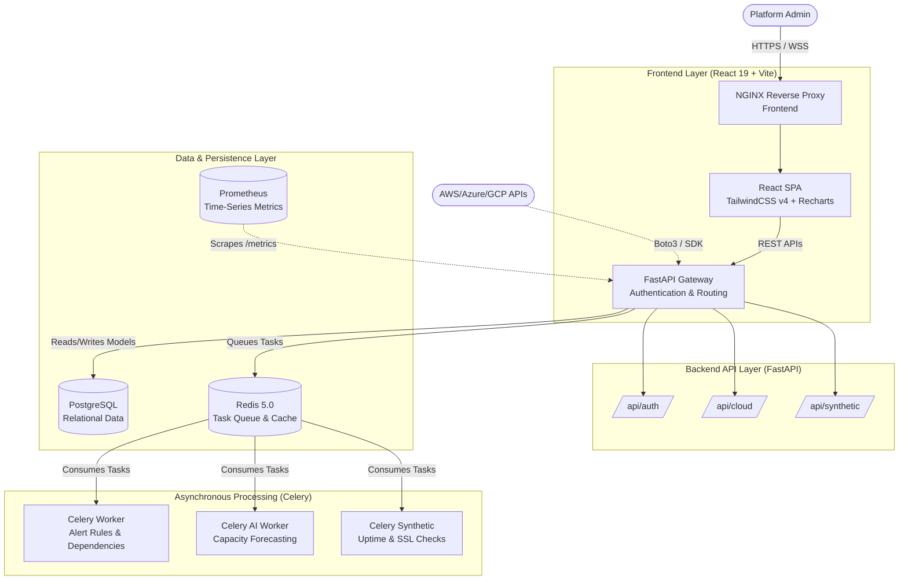

# Cloud Infrastructure Observability & Monitoring Platform ☁️📊


An enterprise-grade, cloud-native monitoring and observability solution designed to provide deep insights into AWS, Azure, and GCP resources, containerized applications (Docker/Kubernetes), and bare-metal servers. Built to mirror the capabilities of industry leaders like Datadog and Dynatrace, offering real-time AI capacity forecasting, global dependency mapping, and comprehensive compliance tracking.

---

## 📸 Platform Previews

### Global Dashboard & Topology
*Real-time server active counts, load averages, area chart visualizations of system spikes, and heatmap overviews.*


### AI Capacity Planning
*Predictive horizons for 7, 30, and 90 days. Uses historical ML-based modeling to accurately warn you of impending CPU, RAM, or Storage exhaustion.*


### Compliance & Security
*A single pane of glass for InfoSec and ATS audits. Tracks SLA uptimes, active incidents, SSL certificates nearing expiry, and critical OS patch rollouts.*


---

## 🏗️ Architecture & Structure Diagram

The platform leverages a distributed, microservices-oriented architecture with asynchronous workers, Celery beat schedules, and synthetic monitoring loops.



---

## 🚀 Key Features & Capabilities (V2.1 Expansion)

### Observability & Auto Discovery
- **Auto Discovery Engine**: A unified cascade engine that automatically crawls your infrastructure hierarchy (e.g., `AWS Account -> EC2 -> ECS -> EKS -> Lambda -> Docker Containers`) to map out active nodes without manual intervention.
- **Service Dependency Mapping**: A directed graph tracking the parent-child relationships between microservices (e.g., Frontend -> API -> Redis). If a parent dependency goes down, the engine suppresses downstream alerts and cascades a root-cause incident.
- **Global Heat Maps**: Visual geographic grid views highlighting the health (healthy, warning, critical) of specific server clusters and regions at a glance.

### Advanced Analytics & AI
- **AI-Based Capacity Forecasting**: Dedicated background Celery processes calculating 7-day, 30-day, and 90-day predictive exhaustion horizons for CPU, RAM, Storage, and Network bandwidth using historical data mapping.
- **AWS Cost Analytics**: Native API integration fetching daily unblended infrastructure cloud expenditure via the `boto3` AWS Cost Explorer API.

### Synthetic Monitoring & Compliance
- **Synthetic Monitoring**: Celery-based test loops that periodically execute outside-in tests on vital endpoints (APIs, Login routes) tracking Availability, Latency, and Error percentages from multiple geographic locations.
- **SSL Certificate Monitoring**: Proactive Python socket monitors parsing domain certificates over TLS handshakes to alert operators on approaching expiry dates (30, 14, and 3-day warnings).
- **Compliance & Security Dashboard**: Aggregated views tracking Security Scores, Open Incidents, Uptime SLAs, and OS Patch Status. Crucial for SOC2 and ISO27001 readiness.

### Core Foundation & Security
- **RBAC Authentication**: Secure JWT-based login and registration utilizing robust `bcrypt` hashing.
- **Slack Alert Integration**: Real-time incident escalation pushing localized payload failures directly to designated Slack channels.
- **Rules Engine**: Asynchronous workers evaluating real-time metric thresholds against PostgreSQL configurations to trigger alarms seamlessly.

---

## 🛠️ Technology Stack

**Frontend:**
- React 19 (Vite)
- TypeScript & TSX
- Tailwind CSS v4 (PostCSS)
- Recharts (Data Visualization)
- Lucide React (Icons)
- React Router DOM v7

**Backend:**
- Python 3.12
- FastAPI (High-performance API framework)
- SQLAlchemy 2.0 & Alembic (ORM & Migrations)
- Pydantic (Data validation including `email-validator`)
- Passlib & bcrypt (Security hashing)
- Celery & Redis (Task queues and brokers)

**Infrastructure & DevOps:**
- PostgreSQL (Primary Data Store)
- Redis (Message Broker & Caching)
- Docker & Docker Compose (Containerization)
- GitHub Actions (CI/CD Pipelines)

---

## 📂 Repository Structure

```text
cloud-monitoring-dashboard/
├── backend/                  # Python FastAPI application
│   ├── api/                  # API routing layer (auth, cloud, metrics)
│   ├── cloud/                # Discovery Engine (AWS, Azure, GCP, K8s)
│   ├── core/                 # Auth, Logging, and Configs
│   ├── notifications/        # Webhooks & Slack Alert integrations
│   ├── models.py             # SQLAlchemy ORM (CloudResource, ServiceDependency, SSLCheck)
│   ├── worker.py             # Standard alerts and dependency cascading
│   ├── worker_ai.py          # AI capacity forecasting engine
│   └── synthetic_worker.py   # Periodic SSL and Uptime ping tests
│
├── frontend/                 # React UI application
│   ├── src/
│   │   ├── components/ui/    # React Flow Dependency Map, Heat Map
│   │   ├── layouts/          # Global Dashboard Layouts
│   │   └── pages/            # Dashboards (Capacity Planning, Compliance, Core)
│   └── postcss.config.js     # Tailwind v4 PostCSS directives
│
├── deployment/               # Cloud-native deployment tooling
│   ├── docker-compose.yml    # Local multi-container orchestration
│   └── helm/                 # Kubernetes Helm Chart (values.yaml, Chart.yaml)
│
├── docs/                     # UI Screenshots and documentation assets
└── tests/                    # Comprehensive QA Suite (Pytest, Vitest)
```

---

## 🚀 Getting Started (Local Development)

### Prerequisites
- **Docker & Docker Compose**
- **Node.js 20+**
- **Python 3.12+**

### 1. Spin up the Database & Cache Infrastructure
Start the PostgreSQL DB and Redis cache using Docker Compose:
```bash
cd deployment
docker-compose up -d
```

### 2. Local Backend Development
Navigate to the backend, set up a virtual environment, and apply database migrations.
```bash
cd backend
python -m venv venv
source venv/bin/activate      # On Windows: venv\Scripts\activate
pip install -r requirements.txt
alembic upgrade head          # Apply database schema
fastapi dev main.py           # Start the server on port 8000
```
> The API will be available at `http://localhost:8000`. Swagger documentation is auto-generated at `http://localhost:8000/docs`.

### 3. Local Frontend Development
Navigate to the frontend to install dependencies and run the Vite dev server.
```bash
cd frontend
npm install
npm run dev
```
> The React Dashboard will be available at `http://localhost:5173`.

### 4. Background Workers (Celery)
To evaluate alerts, run AI predictions, and execute synthetic tests, you need to spin up the background workers alongside your API:
```bash
cd backend
celery -A worker celery_app worker --loglevel=info
celery -A worker_ai celery_ai_app worker --loglevel=info
celery -A synthetic_worker synthetic_app worker --loglevel=info
```

---

## 🧪 Testing & CI/CD Strategy

The platform maintains strict quality assurance through automated GitHub Actions pipelines.

### Automated Pipelines
1. **Frontend CI**: Checks out the code, installs Node 20, runs TypeScript compiler checks, and builds the Vite output (`npm run build`). Validates Tailwind v4 PostCSS compilation.
2. **Backend CI**: Sets up Python 3.12, installs all `requirements.txt` dependencies, and executes the Pytest suite against a local SQLite testing database.
3. **Docker Build**: Validates that both the backend and frontend Dockerfiles successfully compile into deployable images.

### Running Tests Locally
- **Backend (Pytest)**: 
  ```bash
  cd backend
  PYTHONPATH=. pytest ../tests/backend -v
  ```
- **Frontend Build Verification**: 
  ```bash
  cd frontend
  npm run build
  ```
