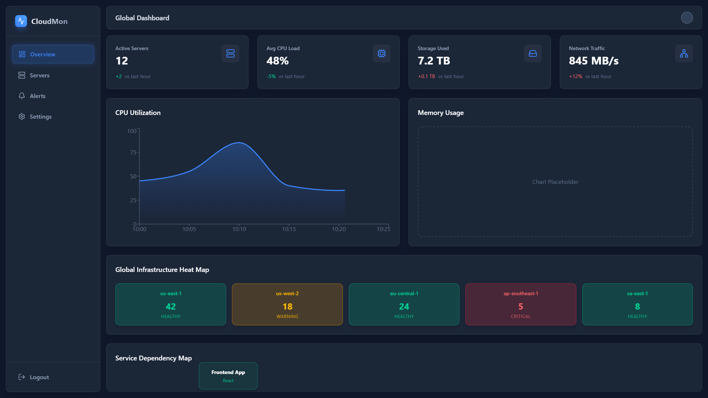
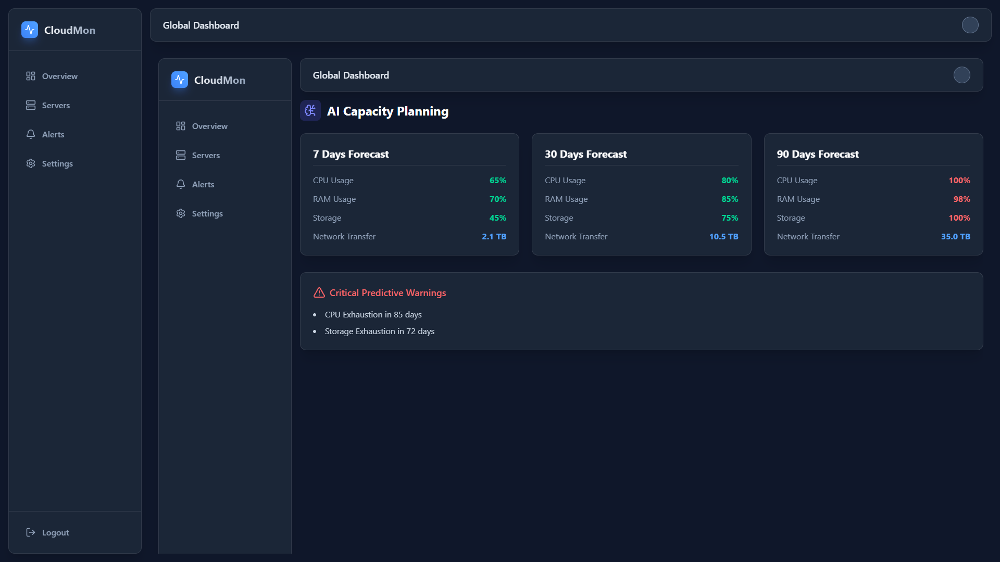
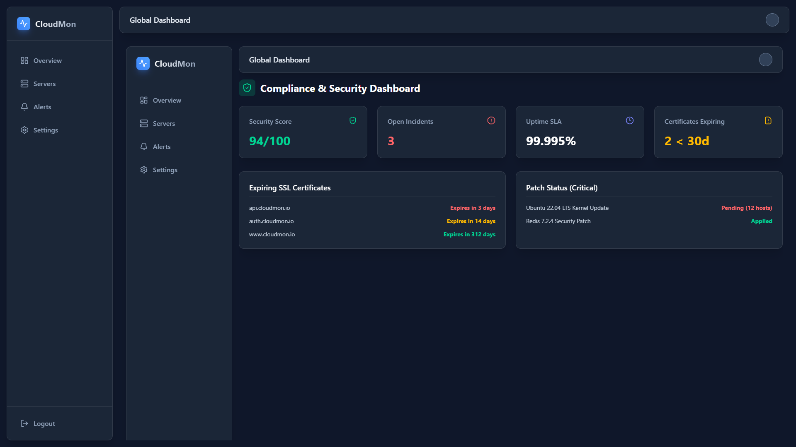
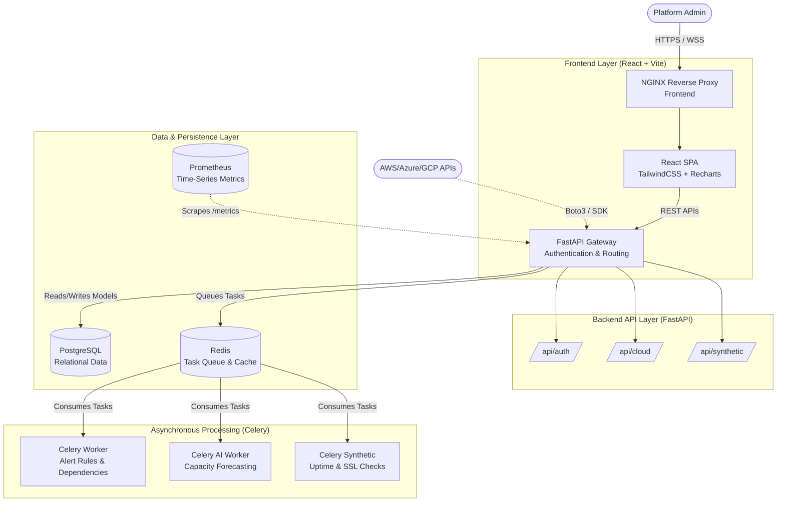

# Cloud Infrastructure Observability & Monitoring Platform ☁️📊

An enterprise-grade, cloud-native monitoring and observability solution designed to provide deep insights into AWS, Azure, and GCP resources, containerized applications (Docker/Kubernetes), and bare-metal servers. Built to mirror the capabilities of industry leaders like Datadog and Dynatrace.

---

## 📸 Platform Previews

### Global Dashboard & Topology


### AI Capacity Planning


### Compliance & Security


---

## 🏗️ Architecture & Structure Diagram

The platform leverages a distributed, microservices-oriented architecture with asynchronous workers and synthetic monitoring loops.



---

## 🚀 Features (V2.1 Expansion)

### Observability & Auto Discovery
- **Auto Discovery Engine**: A unified cascade engine that automatically crawls your infrastructure hierarchy (e.g., `AWS Account -> EC2 -> ECS -> EKS -> Lambda -> Docker Containers`).
- **Service Dependency Mapping**: A directed graph tracking the parent-child relationships between microservices (e.g., Frontend -> API -> Redis). If a parent fails, it automatically cascades incident generation down the chain.
- **Global Heat Maps**: Visual geographic grid view highlighting the health (healthy, warning, critical) of specific regions at a glance.

### Advanced Analytics & AI
- **AI-Based Capacity Forecasting**: Dedicated background processes calculating 7-day, 30-day, and 90-day predictive exhaustion horizons for CPU, RAM, Storage, and Network bandwidth using historical data mapping.
- **AWS Cost Analytics**: API integration fetching daily unblended infrastructure cloud expenditure via the AWS Cost Explorer API.

### Synthetic Monitoring & Compliance
- **Synthetic Monitoring**: Celery-based test loops that periodically execute outside-in tests on endpoints (APIs, Login routes) tracking Availability, Latency, and Error %.
- **SSL Certificate Monitoring**: Proactive Python socket monitors parsing domain certificates to alert on approaching expiry dates.
- **Compliance & Security Dashboard**: Aggregated views tracking Security Scores, Open Incidents, Uptime SLAs, and OS Patch Status for ATS audits.

### Core Foundation
- **RBAC Authentication**: Secure JWT-based login and registration.
- **Rules Engine**: Asynchronous Celery workers evaluating metric thresholds against PostgreSQL configurations in real-time.
- **Prometheus & Helm**: Full Kubernetes Helm charts and Prometheus scrape targets built-in.

---

## 📂 Project Structure

```text
cloud-monitoring-dashboard/
├── backend/                  # Python FastAPI application
│   ├── api/                  # API routing layer
│   ├── cloud/                # Discovery Engine (AWS, Azure, GCP, K8s)
│   ├── core/                 # Auth, Logging, and Configs
│   ├── models.py             # SQLAlchemy ORM (CloudResource, ServiceDependency, SSLCheck)
│   ├── worker.py             # Standard alerts and dependency cascading
│   ├── worker_ai.py          # AI capacity forecasting engine
│   └── synthetic_worker.py   # Periodic SSL and Uptime ping tests
│
├── frontend/                 # React UI application
│   ├── src/
│   │   ├── components/ui/    # React Flow Dependency Map, Heat Map
│   │   └── pages/            # Dashboards (Capacity Planning, Compliance, Core)
│
├── deployment/               # Cloud-native deployment tooling
│   ├── docker-compose.yml    # Local multi-container orchestration
│   └── helm/                 # Kubernetes Helm Chart (values.yaml, Chart.yaml)
│
└── tests/                    # Comprehensive QA Suite (Pytest, Vitest, Playwright)
```

---

## 🛠️ Quick Start & Setup

### 1. Run Everything via Docker
Start the PostgreSQL DB, Redis cache, and Prometheus monitor using Docker Compose:
```bash
cd deployment
docker-compose up -d
```

### 2. Local Backend Development
```bash
cd backend
python -m venv venv
source venv/bin/activate
pip install -r requirements.txt
alembic upgrade head
fastapi dev main.py
```
> The API will be available at `http://localhost:8000`. Swagger documentation is auto-generated at `/docs`.

### 3. Local Frontend Development
```bash
cd frontend
npm install
npm run dev
```
> The React Dashboard will be available at `http://localhost:5173`.

### 4. Background Workers (Celery)
To evaluate alerts, AI predictions, and synthetic tests:
```bash
cd backend
celery -A worker celery_app worker --loglevel=info
celery -A worker_ai celery_ai_app worker --loglevel=info
celery -A synthetic_worker synthetic_app worker --loglevel=info
```

---

## 🧪 Testing Strategy

The platform is secured by a robust testing strategy running on GitHub Actions.
- **Backend (Pytest)**: `cd backend && PYTHONPATH=. pytest ../tests/backend -v`
- **Frontend (Vitest)**: `cd frontend && npm run test`
- **End-to-End (Playwright)**: `npx playwright test` inside `/tests/e2e`
